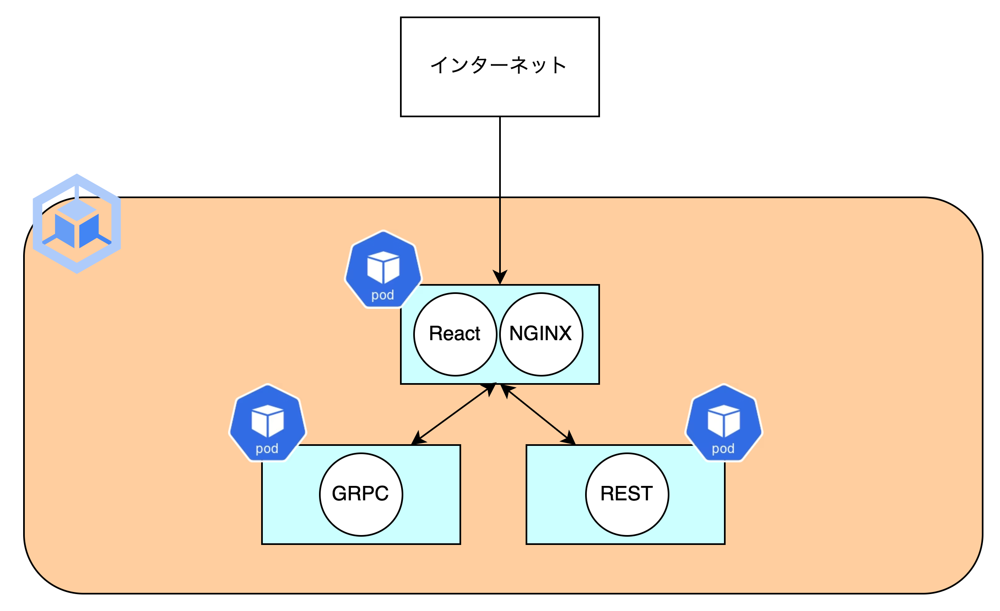

# streaming-server

Simple chat service that works with GKE.


## Table of Contents

- [streaming-server](#streaming-server)
  - [Table of Contents](#table-of-contents)
  - [Description](#description)
- [System Architecture](#system-architecture)
- [How to run in local](#how-to-run-in-local)
  - [Set the secrets](#set-the-secrets)
    - [fast\_api](#fast_api)
    - [grpc\_api](#grpc_api)
    - [frontend](#frontend)
  - [run up](#run-up)
- [How to Deploy](#how-to-deploy)


## Description
This repository is simple chat service that works with GKE.

When you send a chat, the LLM will automatically reply to you.


# System Architecture



# How to run in local
## Set the secrets
### fast_api

```sh
$ cd path/to/fast_api
$ vim .env
```

You must set OPEN AI SECRET KEY.

```sh
OPENAI_API_VERSION=xxxxx
OPENAI_API_BASE=xxxxx
OPENAI_API_KEY=xxxxx
OPENAI_CHAT_ENGINE=xxxxx
```

### grpc_api

```
$ cd path/to/grpc_api/src
$ vim .env
```

You must set OPEN AI SECRET KEY.

```sh
OPENAI_API_VERSION=xxxxx
OPENAI_API_BASE=xxxxx
OPENAI_API_KEY=xxxxx
OPENAI_CHAT_ENGINE=xxxxx
```

### frontend

```sh
$ cd path/to/frontend
$ vim .env
```

You must set URI.

```sh
REACT_APP_REST_API_URL=http://localhost:5000
REACT_APP_GRPC_API_URL=http://localhost:9000

```


## run up

```
$ cd path/to/streaming-server
$ docker compose up --build -d
```

# How to Deploy
1. Create .env files.
```sh
# .env
OPENAI_API_VERSION=xxxxx
OPENAI_API_BASE=xxxxx
OPENAI_API_KEY=xxxxx
OPENAI_CHAT_ENGINE=xxxxx
```

2. Set k8s secrets.
```sh
kubectl create secret generic --save-config openai-secret --from-env-file .env
```

3. Upload to Artifact Registry.
```Makefile
gcloud auth configure-docker asia-northeast1-docker.pkg.dev
docker build -t $(ARTIFACT_REPOSITORY)/$(PROJECT_ID)/$(REPOSITORY_NAME)/$(API_IMAGE_NAME):$(SHORT_SHA) -f $(DOCKERFILE_REPOSITORY)/$(DOCKERFILE_API) .
docker push $(ARTIFACT_REPOSITORY)/$(PROJECT_ID)/$(REPOSITORY_NAME)/$(API_IMAGE_NAME):$(SHORT_SHA)
```

4. deploy to GKE.
```Makefile
gcloud auth configure-docker asia-northeast1-docker.pkg.dev
docker build -t $(ARTIFACT_REPOSITORY)/$(PROJECT_ID)/$(REPOSITORY_NAME)/$(API_IMAGE_NAME):$(SHORT_SHA) -f $(DOCKERFILE_REPOSITORY)/$(DOCKERFILE_API) .
docker push $(ARTIFACT_REPOSITORY)/$(PROJECT_ID)/$(REPOSITORY_NAME)/$(API_IMAGE_NAME):$(SHORT_SHA)
```
